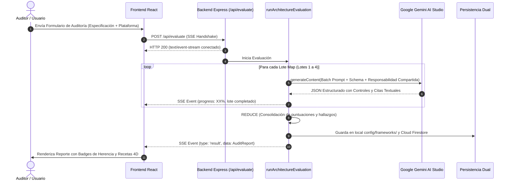
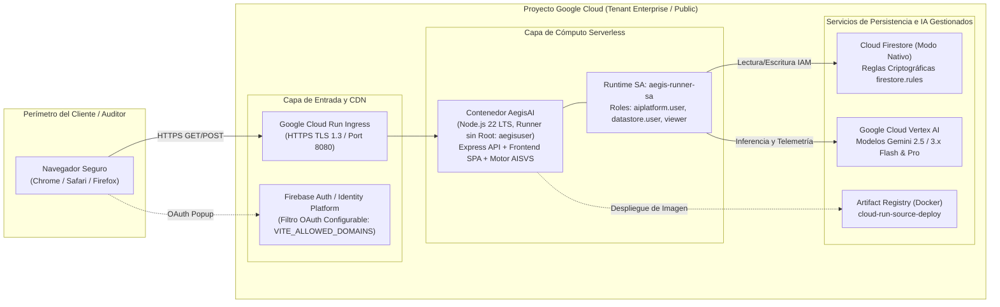

# AEGIS AI ASSURANCE PLATFORM
## Documento de Arquitectura de Software (Software Architecture Document - SAD)
**Versión:** 2.5.0 Enterprise (Edición 2026)  
**Estándar de Documentación:** Basado en IEEE 1471 / ISO/IEC 42010 y Modelo 4+1 Vistas  
**Clasificación:** Documento Técnico de Arquitectura y Diseño para Ingenieros Principales y Auditores

---

## 1. Introducción y Metas de Arquitectura

### 1.1 Propósito
Este documento describe formalmente la arquitectura de software de **AegisAI**, una plataforma de misión crítica orientada al aseguramiento de calidad, ciberseguridad y cumplimiento normativo en sistemas de Inteligencia Artificial Generativa y Machine Learning.

### 1.2 Atributos de Calidad Principales (Quality Attributes)
1. **Hiper-Factualidad Determinista (QA-01):** Cero tolerancia a alucinaciones. La IA debe evaluar exclusivamente con base en la evidencia documental provista, rechazando inferencias no fundamentadas.
2. **Capacidad de Salida Completa sin Truncamiento (QA-02):** Capacidad de auditar más de 40 controles técnicos exhaustivos sin sobrepasar el límite estricto de 8,192 tokens de salida por llamada de los LLMs.
3. **Inmutabilidad y Trazabilidad Forense (QA-03):** Cumplimiento del Invariante 4 de OWASP AI-SVS: los registros de auditoría no pueden ser alterados ni borrados una vez dictaminados.
4. **Resiliencia y Alta Disponibilidad (QA-04):** Tolerancia a fallos ante caídas transitorias de red, límites de cuota de proveedores de nube o saturación de modelos.
5. **Rendimiento y Baja Latencia (QA-05):** Ingestión de normativas legales y procesamiento en tiempo real con latencias sub-segundo en tareas estructuradas.

---

## 2. Patrones de Diseño y Decisiones Arquitectónicas

### 2.1 Patrón Map-Reduce para Inferencia Distribuida
- **Problema:** Los modelos LLM contemporáneos disponen de ventanas de entrada masivas (1M a 2M tokens), pero mantienen un límite rígido de generación de salida (**completion tokens**) de 8,192 tokens. Al intentar auditar 12 capítulos (44 controles) con recetas de mitigación completas en una sola petición, el modelo comprime o trunca drásticamente las respuestas.
- **Solución:** Se implementó una arquitectura Map-Reduce en `server.ts`:
  - **Fase MAP:** Los capítulos del estándar se particionan en 3 o 4 lotes paralelos (ej. Lote 1: C01-C03; Lote 2: C04-C06; Lote 3: C07-C09; Lote 4: C10-C12). Cada lote se envía de forma independiente al LLM con el esquema estructurado estricto.
  - **Fase REDUCE:** El orquestador unifica en memoria las matrices de resultados, calcula la calificación ponderada general y consolida las no conformidades en el objeto final `AuditReport`.

### 2.2 Patrón de Streaming Server-Sent Events (SSE)
- **Problema:** Una evaluación técnica exhaustiva de más de 40 controles toma entre 20 y 45 segundos. Una llamada HTTP síncrona tradicional provocaría bloqueos de interfaz o timeouts en proxies.
- **Solución:** La ruta `/api/evaluate` opera bajo el protocolo SSE (`text/event-stream`), despachando eventos de progreso granulares (`{ type: 'progress', progress: 50, message: '...' }`) y manteniendo la conexión abierta con pulsos `: keep-alive\n\n` cada 12 segundos.

### 2.3 Patrón de Persistencia Dual Resiliente
- **Problema:** Depender exclusivamente de una base de datos en la nube (Cloud Firestore) expone la aplicación a interrupciones por propagación de reglas de seguridad, desconexiones o bloqueos de permisos.
- **Solución:** Todo marco normativo o auditoría se almacena de inmediato en el sistema de archivos local (`config/frameworks/{id}.json`) y se replica de forma asíncrona y no bloqueante en Firestore. Si Firestore devuelve `PERMISSION_DENIED` o falla de red, el sistema continúa operando al 100% desde la caché local.

### 2.4 Patrón de Deduplicación por Responsabilidad Compartida (Shared Responsibility)
- **Problema:** En arquitecturas desplegadas sobre Google Gemini Enterprise SaaS, penalizar al cliente por no demostrar cómo cifra los pesos del modelo en hardware TPU físico es un error de auditoría que desvía la atención de la seguridad de la aplicación.
### 2.5 Patrón de Desacoplamiento Multi-Proveedor e Inferencia Universal
- **Problema:** Forzar la dependencia exclusiva de un único proveedor de IA (vendor lock-in) impide a clientes corporativos utilizar sus acuerdos existentes con OpenRouter, OpenAI, o servidores locales de inferencia (vLLM, Ollama, LiteLLM).
- **Solución:** Se implementó un motor desacoplado centrado en `executeAIWithFallback`:
  - Si el proveedor configurado es `gemini`, utiliza el SDK `@google/genai` con su jerarquía de resiliencia (`gemini-3.8-flash` -> `gemini-3.1-flash-lite` -> `gemini-3.7-flash`).
  - Si el proveedor es `openrouter`, `openai` o `custom_openai_compatible`, utiliza un cliente HTTP nativo que implementa la especificación universal `/v1/chat/completions` con timeouts de 120s, backoff exponencial, extracción estricta de JSON y accounting de tokens de entrada y salida.

### 2.6 Patrón de Generación de Arquitectura Remediada (Drop-in Replacement)
- **Problema:** Entregar a un cliente únicamente un reporte con calificaciones reprobatorias o listas de no conformidades no resuelve la brecha técnica y genera fricción operativa.
- **Solución:** Cuando se detectan fallas o falta de evidencia, el sistema orquesta una fase de remediación sintética. El motor toma la arquitectura original del usuario y teje todas las salvaguardas faltantes (sanitización anti-inyección, anonimización DLP, aislamiento RAG, logs inmutables y escalamiento humano), produciendo un documento Markdown (`.md` / `.txt`) listo para producción que garantiza el **100.0% de cumplimiento normativo**.

### 2.7 Patrón de Orquestación Multi-Normativa Simultánea (Compliance 360°)
- **Problema:** En entornos de producción y sectores regulados (banca, retail, salud), un sistema de IA debe satisfacer simultáneamente múltiples capas normativas: ciberseguridad técnica (OWASP AI-SVS 1.0), gobernanza de IA y gestión de riesgos (ISO/IEC 42001:2023), privacidad de datos (LFPDPPP / INAI) y transparencia comercial (LFPC / PROFECO). Ejecutar auditorías fragmentadas multiplica la latencia y genera silos de reporte.
- **Solución:** `runArchitectureEvaluation` soporta la especificación concurrente de múltiples marcos normativos mediante `selectedStandards: string[]`. Durante la fase MAP, el motor agrega los lotes de todos los estándares seleccionados, inyectando metadatos de linaje (`standardId`, `standardName`, `contextText`) en cada bloque de inferencia. En la fase REDUCE, el sistema calcula la métrica global y estructura el arreglo `standardsBreakdown`, donde cada estándar preserva su calificación independiente (0-100%), total de controles evaluados y estado de cumplimiento, permitiendo renderizar tableros de Compliance 360° y exportar reportes ejecutivos consolidados.

### 2.8 Patrón de Inspección en Vivo de Infraestructura Cloud (GCP Live Scanner - Zero-Footprint)
- **Problema:** Auditar exclusivamente documentos estáticos o diagramas escritos introduce sesgos humanos ("wishful thinking" o discrepancias entre la especificación y la implementación real). Asimismo, desplegar agentes de software o funciones en el proyecto del cliente genera fricción con áreas de ciberseguridad corporativa por costos, riesgos de estabilidad y procesos de aprobación.
- **Solución:** Se diseñó el servicio `gcpScannerService`, que interactúa exclusivamente con el **Plano de Control de Google Cloud (Management APIs)** mediante consultas `HTTP GET` de solo lectura. El servicio soporta autenticación en memoria mediante ADC (Cloud Run), tokens temporales Bearer o Cuentas de Servicio sin persistencia de llaves en disco. Inspecciona configuraciones críticas de Cloud IAM, Vertex AI, Cloud Run, Cloud Storage y Secret Manager, sintetizando un manifiesto técnico estructurado (`<gcp_live_infrastructure_manifest>`) que se alimenta directamente al motor Map-Reduce multi-normativo, garantizando una auditoría basada en la realidad viva de la nube con **cero huella y cero recursos creados en el cliente**.

---

## 3. Vista de Componentes Lógicos

```mermaid
flowchart TD
    subgraph ClientLayer ["Capa de Cliente (Frontend SPA)"]
        UI["React 19 + Tailwind CSS v4\nCode-Splitting por Vistas"]
        SSE_Client["SSE Event Consumer\nStreaming Reactivo"]
        PDF_Engine["jsPDF + AutoTable\nCarga Dinámica Bajo Demanda"]
        RemediationUI["Modal de Vista Previa y\nDescarga de Arquitectura Remediada"]
    end

    subgraph GatewayLayer ["Capa de Enrutamiento y Seguridad (Express)"]
        SecHeaders["Cabeceras OWASP\n(nosniff, SAMEORIGIN, PermPolicy)"]
        DotfileBlocker["Filtro Anti-Sondeo\n(Bloqueo de /.env, .key, .git)"]
        AuthMiddleware["Autenticación RBAC\n(x-admin-token, x-api-key)"]
    end

    subgraph CoreEngine ["Núcleo Evaluador de IA Multi-Proveedor"]
        Orchestrator["runArchitectureEvaluation\n(Orquestador Map-Reduce)"]
        Decomposer["decomposeLegalDocument\n(Motor Universal BYOF)"]
        Remediator["remediatedArchitectureGenerator\n(Síntesis de 100% Cumplimiento)"]
        Dispatcher["executeAIWithFallback\n(Despachador Central)"]
        GeminiClient["Google GenAI SDK\n(Fallback Chain 503/429)"]
        UniversalOpenAI["Cliente Universal /v1/chat/completions\n(OpenRouter / OpenAI / vLLM / Ollama)"]
    end

    subgraph PersistenceLayer ["Capa de Persistencia Dual"]
        LocalFS["Sistema de Archivos Local\nconfig/frameworks/*.json & admin-settings.json"]
        CloudFirestore["Google Cloud Firestore\nColecciones: audits, custom_frameworks"]
    end

    UI --> SecHeaders
    SecHeaders --> DotfileBlocker
    DotfileBlocker --> AuthMiddleware
    AuthMiddleware --> Orchestrator
    AuthMiddleware --> Decomposer
    AuthMiddleware --> Remediator
    Orchestrator --> Dispatcher
    Decomposer --> Dispatcher
    Remediator --> Dispatcher
    Dispatcher -->|gemini| GeminiClient
    Dispatcher -->|openrouter/openai/local| UniversalOpenAI
    Orchestrator --> LocalFS
    Orchestrator --> CloudFirestore
    Decomposer --> LocalFS
    Decomposer --> CloudFirestore
    Orchestrator -. Eventos SSE .-> SSE_Client
    Remediator -. Especificación .md .-> RemediationUI
```

---

## 4. Modelos de Dominio y Datos

### 4.1 Entidad `AuditReport`
Estructura representativa del dictamen técnico emitido:
```typescript
interface AuditReport {
  id: string;                      // Identificador unívoco (ej. LFPDPPP-2026-0001)
  date: string;                    // Marca temporal ISO 8601
  systemName: string;              // Nombre del sistema auditado
  technicalLead: string;           // Líder técnico responsable
  email: string;                   // Correo de contacto
  description: string;             // Especificación técnica evaluada
  standard: 'AI-SVS' | 'ISO-42001' | 'FULL' | 'CUSTOM';
  customFrameworkId?: string;      // ID de la ley personalizada si standard === 'CUSTOM'
  customFrameworkName?: string;    // Nombre descriptivo de la regulación
  targetLevel: 'L1' | 'L2' | 'L3' | 'AUTO';
  assessedLevel: 'L1' | 'L2' | 'L3';
  levelAssessmentRationale: string;// Justificación técnica del nivel
  techPlatform: string;            // gemini-enterprise, vertex-ai, self-hosted
  techPlatformName: string;        // Nombre comercial de la plataforma
  deploymentType: 'SaaS' | 'PaaS' | 'IaaS' | 'Self-Hosted';
  overallScore: number;            // Calificación ponderada (0-100%)
  executiveSummary: string;        // Resumen ejecutivo de riesgos
  chapters: StandardChapter[];     // Capítulos evaluados con sus puntos probados
  modelUsed: string;               // Modelo exacto de Gemini utilizado
  latencyMs: number;               // Tiempo total de inferencia
  promptTokens: number;            // Tokens de entrada
  completionTokens: number;        // Tokens de salida generados
}
```

### 4.2 Entidad `PuntoProbado` y Receta 4D de Mitigación
```typescript
interface PuntoProbado {
  id: string;                      // Identificador del control (ej. LFPDPPP-03.1)
  name: string;                    // Título del requisito
  status: 'Aprobado' | 'Requiere Revisión' | 'Falta Evidencia' | 'No Aplica';
  findings: string;                // Hallazgos y justificación técnica
  fuenteEvidencia?: string;        // Cita textual exacta de la documentación
  isInheritedFromPlatform?: boolean;// True si está cubierto por Google Cloud SaaS
  inheritedPlatformName?: string;  // Nombre de la nube acreditada
  level?: 'L1' | 'L2' | 'L3';      // Nivel de verificación
  isMandatoryForTargetLevel?: boolean;
  remediationDetails?: {
    strategy: string;              // Dimensión 1: Estrategia arquitectónica
    actionableSteps: string[];     // Dimensión 2: Checklist paso a paso
    codeOrConfigExample: string;   // Dimensión 3: Código o manifiesto real
    verificationRecipe: string;    // Dimensión 4: Script de pentesting / curl QA
    effortLevel: string;           // Esfuerzo estimado (< 1 día, 1-3 días, etc.)
    recommendedTools: string[];    // Librerías recomendadas (Presidio, Sigstore)
  };
}
```

---

## 5. Vista de Procesos: Diagramas de Secuencia

### 5.1 Flujo de Auditoría con Map-Reduce y Streaming SSE


---

## 6. Modelo de Amenazas y Seguridad (Threat Modeling)

AegisAI ha sido sometido y blindado frente a las 10 categorías de amenazas de **OWASP Top 10 for LLM Applications**:

| Identificador | Vector de Amenaza | Mecanismo de Defensa Implementado en AegisAI |
| :--- | :--- | :--- |
| **LLM01** | Prompt Injection | Delimitadores estrictos `<user_candidate_architecture>`, parámetros deterministas (`temp: 0.0`) y aislamiento de datos de entrada como no confiables. |
| **LLM02** | Insecure Output Handling | Tipado rígido en esquemas JSON, sanitización contra XSS en React y renderizado seguro en exportadores de PDF y Markdown. |
| **LLM03** | Data Poisoning | Validación estructural obligatoria en la ingesta de normativas (`frameworkDecomposerSchema`). |
| **LLM04** | Model Denial of Service | Límite máximo de payload en Express (15MB), rechazo HTTP 413 ante cargas mayores y streaming SSE con control de flujo. |
| **LLM05** | Supply Chain Vulnerabilities | Dependencias reducidas, bloqueo en `package-lock.json` y cero dependencias con CVEs críticas. |
| **LLM06** | Information Disclosure | Máscaras automáticas en logs que impiden la exfiltración de claves de API (`AIzaSy...`) o tokens en respuestas de error. |
| **LLM07** | Insecure Plugin Design | Middlewares estrictos `authenticateAdmin` (`x-admin-token`) y `authenticateApi` (`x-api-key`) para endpoints sensibles. |
| **LLM08** | Excessive Agency | Invariante 4 de OWASP AI-SVS: Las auditorías son inmutables; no existen rutas HTTP DELETE para eliminar reportes. |
| **LLM09** | Overreliance (Alucinación) | Obligatoriedad de citas textuales de evidencia; si la documentación no lo menciona, el dictamen es "Falta Evidencia". |
| **LLM10** | Model Theft / File Probing | Middleware anti-sondeo que bloquea solicitudes a dotfiles (`/.env`, `.key`, `.git`) retornando HTTP 404 inmediato. |

---

## 7. Vista de Despliegue en la Nube (Cloud Deployment View)

La arquitectura de infraestructura de AegisAI aprovecha el ecosistema administrado de **Google Cloud Platform (GCP)** para garantizar alta disponibilidad (99.95%), cero mantenimiento de servidores y aislamiento estricto de red:



### 7.1 Componentes de Infraestructura y Mapeo de Servicios
| Componente GCP | Servicio Técnico | Rol y Responsabilidad |
| :--- | :--- | :--- |
| **Cómputo Serverless** | Google Cloud Run | Aloja el contenedor monolítico optimizado (`dist/server.cjs` + SPA estática). Escala de 0 a 10 instancias en función de la demanda. |
| **Registro de Contenedores** | Google Artifact Registry | Almacena y escanea las imágenes Docker multi-stage firmadas. |
| **Identidad y Acceso** | Firebase Auth / Identity Platform | Provee inicio de sesión corporativo federado con Google Workspace y valida pertenencia a dominios corporativos autorizados. |
| **Base de Datos NoSQL** | Cloud Firestore (Nativo) | Almacena reportes emitidos, metadatos de auditoría y catálogos normativos personalizados con persistencia distribuida. |
| **Inferencia e IA** | Vertex AI / Gemini API | Ejecuta las consultas Map-Reduce de auditoría y extrae telemetría factual del proyecto. |
| **Automatización CI/CD** | Google Cloud Build | Orquesta la compilación en la nube sin requerir Docker en las estaciones de trabajo de los desarrolladores. |
