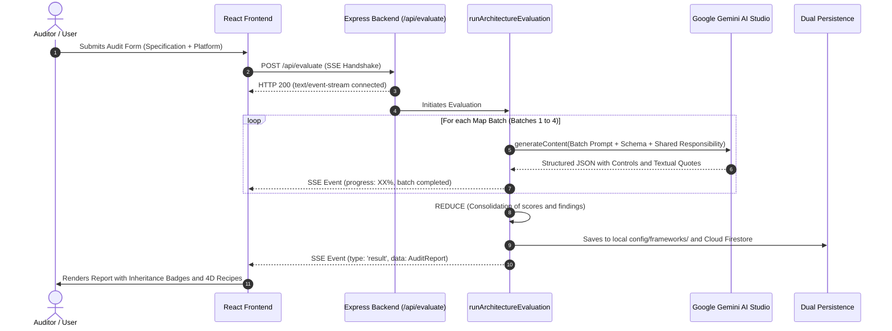
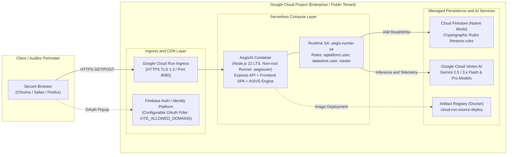

# AEGIS AI ASSURANCE PLATFORM
## Software Architecture Document (SAD)
**Version:** 2.5.0 Enterprise (2026 Edition)  
**Documentation Standard:** Based on IEEE 1471 / ISO/IEC 42010 and the 4+1 View Model  
**Classification:** Technical Architecture and Design Document for Principal Engineers and Auditors

---

## 1. Introduction and Architectural Goals

### 1.1 Purpose
This document formally describes the software architecture of **AegisAI**, a mission-critical platform focused on quality assurance, cybersecurity, and regulatory compliance in Generative Artificial Intelligence and Machine Learning systems.

### 1.2 Core Quality Attributes
1. **Deterministic Hyper-Factuality (QA-01):** Zero tolerance for hallucinations. The AI must evaluate exclusively based on the provided documentary evidence, rejecting unsupported inferences.
2. **Complete Output Capacity Without Truncation (QA-02):** The ability to audit over 40 comprehensive technical controls without exceeding the strict 8,192-token output limit per LLM call.
3. **Immutability and Forensic Traceability (QA-03):** Compliance with OWASP AI-SVS Invariant 4: audit logs cannot be altered or deleted once adjudicated.
4. **Resiliency and High Availability (QA-04):** Fault tolerance against transient network drops, cloud provider quota limits, or model saturation.
5. **Performance and Low Latency (QA-05):** Legal framework ingestion and real-time processing with sub-second latencies on structured tasks.

---

## 2. Design Patterns and Architectural Decisions

### 2.1 Map-Reduce Pattern for Distributed Inference
- **Problem:** Contemporary LLM models feature massive input windows (1M to 2M tokens), but maintain a rigid generation limit (**completion tokens**) of 8,192 tokens. Attempting to audit 12 chapters (44 controls) with complete mitigation recipes in a single request causes the model to severely compress or truncate its responses.
- **Solution:** A Map-Reduce architecture was implemented in `server.ts`:
  - **MAP Phase:** Standard chapters are partitioned into 3 or 4 parallel batches (e.g., Batch 1: C01-C03; Batch 2: C04-C06; Batch 3: C07-C09; Batch 4: C10-C12). Each batch is sent independently to the LLM with the strict structured schema.
  - **REDUCE Phase:** The orchestrator unifies the result matrices in memory, calculates the overall weighted score, and consolidates non-conformities into the final `AuditReport` object.

### 2.2 Server-Sent Events (SSE) Streaming Pattern
- **Problem:** A comprehensive technical evaluation of over 40 controls takes between 20 and 45 seconds. A traditional synchronous HTTP call would cause UI freezes or proxy timeouts.
- **Solution:** The `/api/evaluate` route operates under the SSE protocol (`text/event-stream`), dispatching granular progress events (`{ type: 'progress', progress: 50, message: '...' }`) and keeping the connection alive with `: keep-alive\n\n` heartbeats every 12 seconds.

### 2.3 Resilient Dual Persistence Pattern
- **Problem:** Relying exclusively on a cloud database (Cloud Firestore) exposes the application to outages caused by security rule propagations, disconnections, or permission locks.
- **Solution:** Every regulatory framework or audit is immediately stored in the local file system (`config/frameworks/{id}.json`) and replicated asynchronously and non-blockingly to Firestore. If Firestore returns a `PERMISSION_DENIED` or a network failure occurs, the system continues to operate at 100% capacity from the local cache.

### 2.4 Shared Responsibility Deduplication Pattern
- **Problem:** In architectures deployed on Google Gemini Enterprise SaaS, penalizing the client for failing to prove how model weights are encrypted on physical TPU hardware is an audit error that misdirects attention away from application security.
- **Solution:** The evaluation engine incorporates automated logic to filter out infrastructure provider responsibilities (such as physical hardware security, cloud-level data centers, and multi-tenant isolation), focusing exclusively on the customer-controlled application layer (prompts, RAG, filters, API security, and governance).

### 2.5 Multi-Provider Decoupling and Universal Inference Pattern
- **Problem:** Forcing an exclusive dependency on a single AI provider (vendor lock-in) prevents corporate clients from utilizing their existing agreements with OpenRouter, OpenAI, or local inference servers (vLLM, Ollama, LiteLLM).
- **Solution:** A decoupled engine centered around `executeAIWithFallback` was implemented:
  - If the configured provider is `gemini`, it utilizes the `@google/genai` SDK with its resiliency hierarchy (`gemini-3.8-flash` -> `gemini-3.1-flash-lite` -> `gemini-3.7-flash`).
  - If the provider is `openrouter`, `openai`, or `custom_openai_compatible`, it utilizes a native HTTP client implementing the universal `/v1/chat/completions` specification with 120s timeouts, exponential backoff, strict JSON extraction, and input/output token accounting.

### 2.6 Remediated Architecture Generation Pattern (Drop-in Replacement)
- **Problem:** Providing a client solely with a report containing failing scores or non-conformity lists does not resolve the technical gap and creates operational friction.
- **Solution:** When failures or missing evidence are detected, the system orchestrates a synthetic remediation phase. The engine takes the user's original architecture and weaves in all missing safeguards (anti-injection sanitization, DLP anonymization, RAG isolation, immutable logs, and human scaling), producing a production-ready Markdown document (`.md` / `.txt`) that guarantees **100.0% regulatory compliance**.

### 2.7 Simultaneous Multi-Framework Orchestration Pattern (Compliance 360°)
- **Problem:** In production environments and regulated sectors (banking, retail, healthcare), an AI system must simultaneously satisfy multiple regulatory layers: technical cybersecurity (OWASP AI-SVS 1.0), AI governance and risk management (ISO/IEC 42001:2023), data privacy (LFPDPPP / INAI), and commercial transparency (LFPC / PROFECO). Executing fragmented audits multiplies latency and creates reporting silos.
- **Solution:** `runArchitectureEvaluation` supports the concurrent specification of multiple regulatory frameworks via `selectedStandards: string[]`. During the MAP phase, the engine aggregates batches from all selected standards, injecting lineage metadata (`standardId`, `standardName`, `contextText`) into each inference block. In the REDUCE phase, the system calculates the global metric and structures the `standardsBreakdown` array, where each standard preserves its independent score (0-100%), total evaluated controls, and compliance status, allowing for the rendering of Compliance 360° dashboards and the export of consolidated executive reports.

### 2.8 Live Cloud Infrastructure Inspection Pattern (GCP Live Scanner - Zero-Footprint)
- **Problem:** Auditing exclusively static documents or written diagrams introduces human bias ("wishful thinking" or discrepancies between specification and actual implementation). Likewise, deploying software agents or functions within the client's project generates friction with corporate cybersecurity areas due to cost, stability risks, and approval processes.
- **Solution:** The `gcpScannerService` was designed to interact exclusively with the **Google Cloud Control Plane (Management APIs)** via read-only `HTTP GET` queries. The service supports in-memory authentication via ADC (Cloud Run), temporary Bearer tokens, or Service Accounts without persisting keys to disk. It inspects critical configurations of Cloud IAM, Vertex AI, Cloud Run, Cloud Storage, and Secret Manager, synthesizing a structured technical manifest (`<gcp_live_infrastructure_manifest>`) that feeds directly into the multi-normative Map-Reduce engine, guaranteeing a live cloud-reality-based audit with **zero footprint and zero resources created on the client side**.

---

## 3. Logical Component View

```mermaid
flowchart TD
    subgraph ClientLayer ["Client Layer (SPA Frontend)"]
        UI["React 19 + Tailwind CSS v4\nView-based Code-Splitting"]
        SSE_Client["SSE Event Consumer\nReactive Streaming"]
        PDF_Engine["jsPDF + AutoTable\nDynamic On-Demand Loading"]
        RemediationUI["Remediated Architecture\nPreview & Download Modal"]
    end

    subgraph GatewayLayer ["Routing & Security Layer (Express)"]
        SecHeaders["OWASP Headers\n(nosniff, SAMEORIGIN, PermPolicy)"]
        DotfileBlocker["Anti-Probing Filter\n(/.env, .key, .git Blocking)"]
        AuthMiddleware["RBAC Authentication\n(x-admin-token, x-api-key)"]
    end

    subgraph CoreEngine ["Multi-Provider AI Evaluation Core"]
        Orchestrator["runArchitectureEvaluation\n(Map-Reduce Orchestrator)"]
        Decomposer["decomposeLegalDocument\n(Universal BYOF Engine)"]
        Remediator["remediatedArchitectureGenerator\n(100% Compliance Synthesis)"]
        Dispatcher["executeAIWithFallback\n(Central Dispatcher)"]
        GeminiClient["Google GenAI SDK\n(503/429 Fallback Chain)"]
        UniversalOpenAI["Universal /v1/chat/completions Client\n(OpenRouter / OpenAI / vLLM / Ollama)"]
    end

    subgraph PersistenceLayer ["Dual Persistence Layer"]
        LocalFS["Local File System\nconfig/frameworks/*.json & admin-settings.json"]
        CloudFirestore["Google Cloud Firestore\nCollections: audits, custom_frameworks"]
    end

    UI --> SecHeaders
    SecHeaders --> DotfileBlocker
    DotfileBlocker --> AuthMiddleware
    AuthMiddleware --> Orchestrator
    AuthMiddleware --> Decomposer
    AuthMiddleware --> Remediator
    Orchestrator --> Dispatcher
    Decomposer --> Dispatcher
    Remediator --> Dispatcher
    Dispatcher -->|gemini| GeminiClient
    Dispatcher -->|openrouter/openai/local| UniversalOpenAI
    Orchestrator --> LocalFS
    Orchestrator --> CloudFirestore
    Decomposer --> LocalFS
    Decomposer --> CloudFirestore
    Orchestrator -. SSE Events .-> SSE_Client
    Remediator -. .md Specification .-> RemediationUI
```

---

## 4. Domain and Data Models

### 4.1 `AuditReport` Entity
Representative structure of the issued technical report:
```typescript
interface AuditReport {
  id: string;                      // Unique identifier (e.g., LFPDPPP-2026-0001)
  date: string;                    // ISO 8601 timestamp
  systemName: string;              // Name of the audited system
  technicalLead: string;           // Responsible technical lead
  email: string;                   // Contact email
  description: string;             // Evaluated technical specification
  standard: 'AI-SVS' | 'ISO-42001' | 'FULL' | 'CUSTOM';
  customFrameworkId?: string;      // Custom law ID if standard === 'CUSTOM'
  customFrameworkName?: string;    // Descriptive name of the regulation
  targetLevel: 'L1' | 'L2' | 'L3' | 'AUTO';
  assessedLevel: 'L1' | 'L2' | 'L3';
  levelAssessmentRationale: string;// Technical justification for the level
  techPlatform: string;            // gemini-enterprise, vertex-ai, self-hosted
  techPlatformName: string;        // Commercial name of the platform
  deploymentType: 'SaaS' | 'PaaS' | 'IaaS' | 'Self-Hosted';
  overallScore: number;            // Weighted score (0-100%)
  executiveSummary: string;        // Executive summary of risks
  chapters: StandardChapter[];     // Evaluated chapters with their tested points
  modelUsed: string;               // Exact Gemini model used
  latencyMs: number;               // Total inference time
  promptTokens: number;            // Input tokens
  completionTokens: number;        // Generated output tokens
}
```

### 4.2 `PuntoProbado` Entity and 4D Mitigation Recipe
```typescript
interface PuntoProbado {
  id: string;                      // Control identifier (e.g., LFPDPPP-03.1)
  name: string;                    // Requirement title
  status: 'Aprobado' | 'Requiere Revisión' | 'Falta Evidencia' | 'No Aplica';
  findings: string;                // Findings and technical justification
  fuenteEvidencia?: string;        // Exact textual quote from the documentation
  isInheritedFromPlatform?: boolean;// True if covered by Google Cloud SaaS
  inheritedPlatformName?: string;  // Name of the accredited cloud
  level?: 'L1' | 'L2' | 'L3';      // Verification level
  isMandatoryForTargetLevel?: boolean;
  remediationDetails?: {
    strategy: string;              // Dimension 1: Architectural strategy
    actionableSteps: string[];     // Dimension 2: Step-by-step checklist
    codeOrConfigExample: string;   // Dimension 3: Real code or manifest
    verificationRecipe: string;    // Dimension 4: Pentesting script / curl QA
    effortLevel: string;           // Estimated effort (< 1 day, 1-3 days, etc.)
    recommendedTools: string[];    // Recommended libraries (Presidio, Sigstore)
  };
}
```

---

## 5. Process View: Sequence Diagrams

### 5.1 Audit Flow with Map-Reduce and SSE Streaming


---

## 6. Threat Modeling and Security

AegisAI has been subjected to and hardened against the 10 threat categories of the **OWASP Top 10 for LLM Applications**:

| Identifier | Threat Vector | Defense Mechanism Implemented in AegisAI |
| :--- | :--- | :--- |
| **LLM01** | Prompt Injection | Strict delimiters `<user_candidate_architecture>`, deterministic parameters (`temp: 0.0`), and isolation of input data as untrusted. |
| **LLM02** | Insecure Output Handling | Rigid typing in JSON schemas, anti-XSS sanitization in React, and secure rendering in PDF and Markdown exporters. |
| **LLM03** | Data Poisoning | Mandatory structural validation during regulatory ingestion (`frameworkDecomposerSchema`). |
| **LLM04** | Model Denial of Service | Maximum payload limit in Express (15MB), HTTP 413 rejection for larger payloads, and SSE streaming with flow control. |
| **LLM05** | Supply Chain Vulnerabilities | Minimized dependencies, lockfile enforcement via `package-lock.json`, and zero dependencies with critical CVEs. |
| **LLM06** | Information Disclosure | Automatic log masking that prevents the exfiltration of API keys (`AIzaSy...`) or tokens in error responses. |
| **LLM07** | Insecure Plugin Design | Strict middlewares `authenticateAdmin` (`x-admin-token`) and `authenticateApi` (`x-api-key`) for sensitive endpoints. |
| **LLM08** | Excessive Agency | OWASP AI-SVS Invariant 4: Audits are immutable; no HTTP DELETE routes exist to remove reports. |
| **LLM09** | Overreliance (Hallucination) | Mandatory textual evidence quotes; if the documentation does not mention it, the verdict is "Evidence Missing". |
| **LLM10** | Model Theft / File Probing | Anti-probing middleware that blocks requests to dotfiles (`/.env`, `.key`, `.git`), returning an immediate HTTP 404. |

---

## 7. Cloud Deployment View

The AegisAI infrastructure architecture leverages the managed ecosystem of **Google Cloud Platform (GCP)** to ensure high availability (99.95%), zero server maintenance, and strict network isolation:



### 7.1 Infrastructure Components and Service Mapping
| GCP Component | Technical Service | Role and Responsibility |
| :--- | :--- | :--- |
| **Serverless Compute** | Google Cloud Run | Hosts the optimized monolithic container (`dist/server.cjs` + static SPA). Scales from 0 to 10 instances based on demand. |
| **Container Registry** | Google Artifact Registry | Stores and scans signed multi-stage Docker images. |
| **Identity and Access** | Firebase Auth / Identity Platform | Provides federated corporate sign-in with Google Workspace and validates membership in authorized corporate domains. |
| **NoSQL Database** | Cloud Firestore (Native) | Stores issued reports, audit metadata, and custom regulatory catalogs with distributed persistence. |
| **Inference and AI** | Vertex AI / Gemini API | Executes audit Map-Reduce queries and extracts factual project telemetry. |
| **CI/CD Automation** | Google Cloud Build | Orchestrates cloud-based builds without requiring Docker on developer workstations. |
